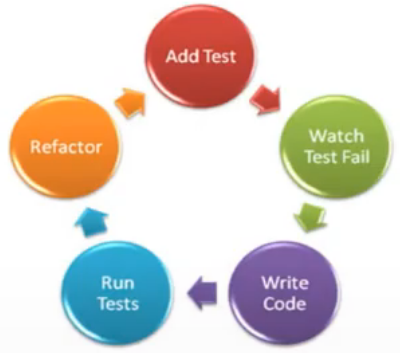

# O que é TDD e seus benefícios

### Objetos

- [X] O que é TDD

- [X] Benefícios

- [X] Exemplos de TDD

### TDD

> TDD = (T)est (D)riven (D)evelopment (Desenvolvimento Orientado por Testes)

* Se baseia em pequenos ciclos de repetições, onde para cada funcionalidade do sistema um teste é criado antes

* Mais sobre: [clique aqui](https://www.devmedia.com.br/test-driven-development-tdd-simples-e-pratico/18533)

* 5 Passos do TDD

  

* **Benefícios**

  * Códigos com muito menos defeitos

  * Design mais limpo

