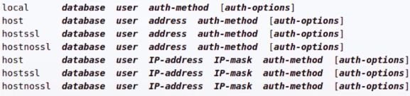
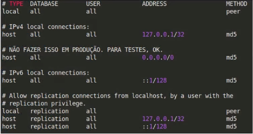
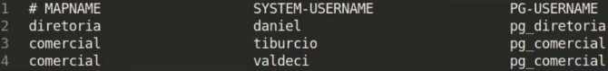
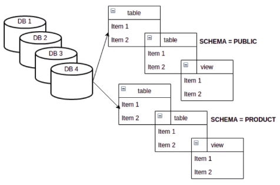
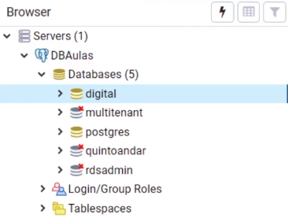
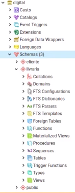

# Fundamentos de banco de dados

## Objetivos

- [X] Arquivo `postgresql.conf`
- [X] Arquivo `pg_hba.conf`
- [X] Arquivo `pg_ident.conf`
- [X] Comandos administrativos

### Arquivo `postgresql.conf`

* Definição

  * Define/armazena todas as configurações do servidor PostgreSQL

  * Algumas dessas configurações necessitam a reinicialização do banco de dados

  * View pg_settings

    * Acessada por dentro do banco de dados
    * Guarda todas as configurações atual
    * Visualizar todas as configurações atuais: `SELECT name, setting FROM pg_settings;`
    * Visualizar um configuração específica: `SHOW [parâmetro]`

  * Localização do arquivo `postgresql.conf`:

    * Ubuntu (instalação padrão)

      * `/etc/postgresql/[versão]/[nome do cluster]/postgresql.conf`

      * Comando: `$ ls -l /etc/postgresql/11/aula/`

  * Configurações de conexão

    * **LISTEN_ADDRESS**

      * Endereço(s) TCP/IP das interfaces que o servidor PostgreSQL escutará/liberará conexões

      * Não é recomendado colocar `*` nesse parâmetro, no ambiente de produção, pois isso permitirá conexões de qualquer IP

    * **PORT** = porta TCP que o servidor PostgreSQL vai ouvir (Padrão: 5432)

    * **MAX_CONNECTIONS** = número máximo de conexões simultâneas no servidor PostgreSQL

    * **SUPERUSER_PRESERVED_CONNECTIONS** = número de conexões (slots) reservadas para conexões ao banco de dados de super usuários

  * Configurações de autenticação

    * **AUTHENTICATION_TIMEOUT** = tempo máximo, em segundos, para o cliente se conectar ao servidor

    * **PASSWORD_ENCRYPTION** = algoritmo de criptografia das senhas dos novos usuários criados no banco de dados

    * **SSL** = habilita a conexão criptografada por SSL

      > Somente se o PostgreSQL foi compilado com suporte SSL

  * Configurações de memória

    * **SHARED_BUFFERS** 
      * Tamanho da memória compartilhada do servidor PostgreSQL para cache/buffer de tabelas, índices e demais relações

      * PostgreSQL identifica os dados que necessitam de rápido acesso e adiciona no cache

    * **WORK_MEM** = tamanho da memória para operações de agrupamento e ordenação (`ORDER BY`, `DISTINCT`, `MERGE JOINS`)

    * **MAINTENANCE_WORK_TEAM** = tamanho da memória para operações administrativas (`VACUUM`, `INDEX`, `ALTER TABLE`) 

* Visualizar todas as configurações do PostgreSQLno terminal: `$ vi /etc/postgresql/[versão]/[nome do cluster]/postgresql.conf`

### Arquivo `pg_hba.conf`

* Responsável pelo controle de autenticação dos usuários no servidor PostgreSQL

* Formato do arquivo:

  

* Métodos de autenticação

  * **TRUST** = conexão sem requisição de senha

  * **REJECT** = rejeitar conexão

  * **MD5** = criptografia md5

  * **PASSWORD** = senha sem criptografia

  * **GSS** = (G)eneric (S)ecurity (S)ervice application program interface

  * **SSPI** = (S)ecurity (S)uport (P)rovider (I)nterface 

    > Apenas para Windows

  * **KRB5** = kerberos V5

  * **IDENT** = utiliza o usuário do sistema operacional do cliente via _ident server_

  * **PEER** = utiliza o usuário do sistema operacional do cliente

  * **LDAP** = _Idap server_

  * **RADIUS** = _radius server_

  * **CERT** = autenticação via certificado SSL do cliente

  * **PAM** = (P)luggable (A)uthentication (M)odules

    > O usuário precisa estar no banco de dados

  * Exemplo de um arquivo `pg_hba.config`

    

### Arquivo `pg_ident.conf`

* Responsável por mapear os usuários do sistema operacional com o usuário do banco de dados

* Localizado no diretório de dados PGDATA

* Opção **ident** deve ser utilizada no arquivo `pg_hba.conf`

* Exemplo

  

### Comandos administrativos

* Ubuntu

  * Listar todos os clusters PostgreSQL: `$ pg_lsclusters`

  * Criar um novo cluster PostgreSQL: `$ pg_createcluster <versão> <cluster>`

  * Apagar um cluster PostgreSQL: `$ pg_dropcluster <versão> <cluster>`

  * Excetuar ações em um cluster PostgreSQL

    * `$ pg_ctlcluster <versão> <cluster> <ação>`

    > Algumas ações: start, stop, status, restart

* Windows

  * No Windows possui uma interface para executar ações no cluster

  * Serviços > Pesquisar pelo serviço PostgreSQL > status

* Binários do PostgreSQL

  * Criar um banco de dados: `$ createdb <banco de dados>`

  * Criar um usuário: `$ createuser <usuário>` 

  * Apagar um banco de dados: `$ dropdb <banco de dados>`

  * Apagar um usuário: `$ dropuser <usuário>`

  * Iniciar um novo cluster: `$ initdb`

    > Criação dos diretórios e arquivos de configuração

  * Executar uma ação no banco de dados: `$ pg_ctl <banco de dados> <ação>`

    > Algumas ações: start, stop, status, restart

  * Iniciar um novo backup do banco de dados: `$ pg_basebackup <banco de dados>`

  * Iniciar um "pseudo" backup do banco de dados: 

    > NÃO É UM BACKUP (Não serve para restauração), irá salvar em um arquivo compactado informações do banco de dados na hora de execução do comando

    * `$ pg_dump <banco de dados>`

    * `$ pg_dumpall`

  * Restauração do banco de dados: `$ pg_restore` 

    > A restauração é feita a partir do arquivo criado no `pg_dump / pg_dumpall`

  * Entrar no banco de dados via sistema operacional: `$ pqsl`

  * Recriação do index do banco de dados: `$ reindexdb`

  * Reorganizar as tabelas de um banco de dados: `$ vacuumdb <banco de dados>`

### Arquitetura/Hierarquia

* **Cluster**

  * Coleção de bancos de dados que compartilham as mesmas configurações (arquivos de configuração) do PostgreSQL e do sistema operacional (porta, listen_addresses, etc)

  * Representação de um **cluster**

    

* **Database** (Banco de dados)

  * conjunto de schemas com seus objetos/relações (tabelas, funções, views, etc)

  * Representação de uma **database**

    

* **Schema** = conjunto de objetos/relações (tabelas, funções, views, etc)

  > **OBS**: alguns banco de dados, como o MySQL, tratam **schema** como **database**. No PostgreSQL, são coisas diferentes.

  * Representação de uma **schema**

    