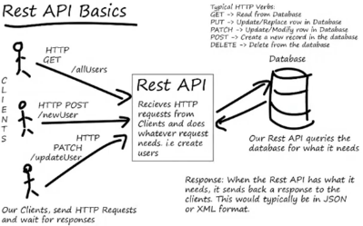
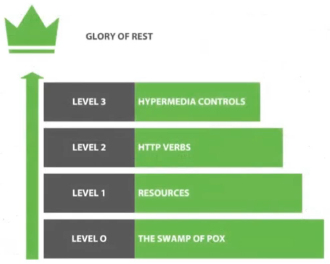
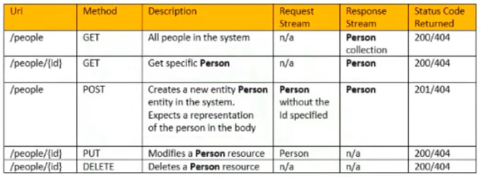

# Desenvolvendo um sistema de gerenciamento de pessoas em API REST com Spring Boot

### Padrão arquitetural REST

### REST VS RESTful

* REST = modelo arquitetural de uma API

  * Acessada a partir do protocolo HTTP

* RESTful = quanto que um API adere aos padrões REST

  * Quando uma API atende 100% dos padrões REST, é dado o nome do modelo de Maturidade de Richardson

* Verbos HTTP

  

