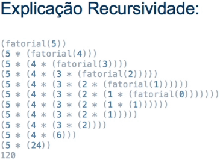
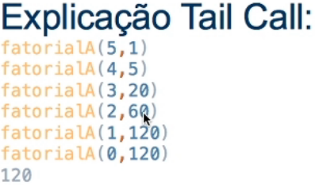

# Recursividade em Java

### Recursividade

* A função é chamada por si mesma até que a condição seja satisfeita

* Como argumento desse tipo de função, é passado um **objeto primitivo**

* Cada chamada gera uma nova entrada na pilha de execução, alguns dados e parâmetros são disponibilizados em escopo global ou local

* Exemplo

  ```java
  public static int fatorial(int numero) {
    if (numero == 1) {
      return numero;
    } else {
      return numero + fatorial(numero - 1)
    }
  }
  ```

  

* Vantagens: 

  * Imutabilidade
  * Código mais declarativo

* Tail Call (Recursividade em cauda)

  * Recursão no qual não há nenhuma linha de código após a chamada de próprio método, sendo assim, não há nenhum tipo de processamento a ser feito após a chamada recursiva.

  * A JVM não suporte a Tail Call (lança **StackOverFlow**)

  * Exemplo

      ```java
      public static int fatorialComTailCall(int numero1, int numero2) {
        if (numero1 == 0) {
          return numero2;
        } else {
          return numero + fatorialComTailCall(numero1 - 1, numero1 + numero2)
        }
      }
      ```

    

  * Vantagens: 

    * Redução no tempo de execução e processamento

* Memoization

  * Técnica de otimização que consiste no cache do resultado de uma função, baseado nos parâmetros de entrada (maior rapidez nas próximas execuções)