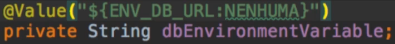

# Configurações com variáveis de ambiente

### Variáveis de ambientes

* Variável de ambiente pode ser injetada através da anotação `@Value` no projeto

* Linux e Mac: export comum de variável: `export ENV_DB_URL=jdbc:h2:mem:db;DB_CLOSE_DELAY=-1`

* Windows: padrão de variável de ambiente

* Injeção com anotação `@Value({NOME_VARIAVEL})`

* Definição de valor _default_ quando não há variável

  

### Checklist

- [X] Injetar a variável com `@Value` em **AppController**

- [X] Definição de valor _default_ junto com a anotação `@Value`

- [X] Criar método para chamada do novo método e exibir o valor

- [X] Executar projeto no terminal e exibir no browser