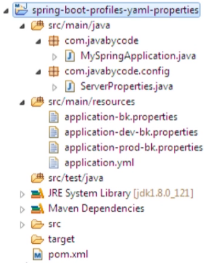
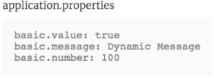
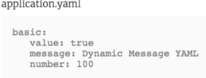

# Configurações com YAML e command line

### Configurações com YAML

* Troca no formato de configurações: formato `.yml`

  

  

  

### Uso de Command line

* Properiedades do arquivo de configuração na linha de comando

* Sobrescreve as propriedades definidas no arquivo de configurações padrão

* Valores passados como argumento na execução do projeto

### Checklist

- [X] Migrar application.properties do profile dev para YML

- [X] Executar o projeto pelo terminal

- [X] Passar como argumento a propriedade `server.port=8085` pelo terminal

    * Comando: `$ mvn spring-boot:run -Dserver.port=8085`

- [X] Executar o projeto no terminal com o argumento

- [X] Abrir o browser no endereço `http://localhost:8085`