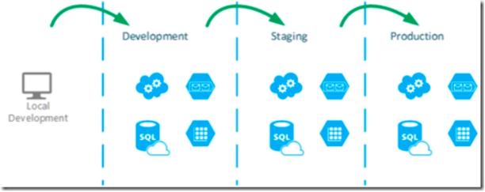

# Importância dos Profiles

### Importância dos **Profiles**

* Múltiplos ambientes

  * Ambientes para desenvolvimento, teste e produção

     

  * Banco de dados para cada ambiente

  * Execução de teste unitários em ambiente local

  * Suíte de testes completas em ambiente de teste

  * Simulação do ambiente real em _staging_

  * Deploy simplificado em produção

* Configurações próprias para cada ambiente

* Ambientes com sua configuração: dev, production, test

  