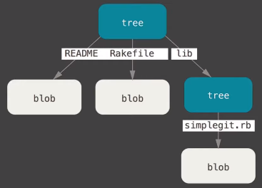
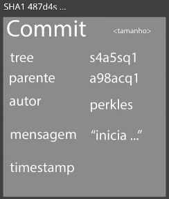

# Tópicos fundamentais para entender o funcionamento do Git

### SHA1

* SHA = (S)ecure (H)ash (A)lgorithm
* É um conjunto de funções hash criptográficas projetadas pela NSA (Agência de segurança Nacional dos EUA)
* A encriptação gera um conjunto de characters identificador de 40 dígitos (**único**)
* É uma "forma curta" de representar um arquivo:

  ```shell
  $ echo "Olá mundo" | openssl sha1
  > (stdin)= f9fc856e559b950175f2b7cd7dad61facbe58e7b
  ```

### Objetos internos fundamentais

* **Blobs** (bolha)

  * Armazena metadados

  * Conteúdo de um **Blob**: **TIPO** + **TAMANHO DO TEXTO/ARQUIVO** + **\0** + **CONTEÚDO**

  * Usando o Git
    ```shell
    $ echo 'conteudo' | git hash-object --stdin
    > fc31e91b26cf85a55e072476de7f263c89260eb1
    ```

    ```shell
    $ echo -e 'blob 9\0conteudo' | openssl sha1
    > fc31e91b26cf85a55e072476de7f263c89260eb1
    ```

  * Usando o OpenSSL
    ```shell
    $ echo 'conteudo' | openssl sha1
    > 65b0d0dda479cc03cce59528e28961e498155f5c
    ```

* **Tree** (árvore)

  * Armazena e referencia para tipos diferentes de **Blobs** e **Trees**

  * Conteúdo de uma **Tree**: **TAMANHO DO ARQUIVO** + **\0** + **REFERÊNCIA DE UM BLOB** + **SHA1** + **NOME DO ARQUIVO**

  * Representação

    

* **Commit**

  * Responsável por "juntar" todos as **Trees** e **Blobs**
  * Aponta para:
    * **Tree**
    * Parente = último **Commit**
    * Autor
    * Mensagem
    * timestamp
  * **OBS**: SHA1 do **commit** é o hash de toda a essa informação

  * Representação

    

### Sistema distribuído

### Segurança