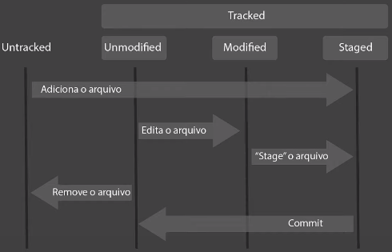

# Passo a passo no ciclo de vida

### `$ git init`

* Criação do diretório `.git`
* Inicialização de um repositório Git

### Tracked ou Untracked

* **Tracked** = arquivos que são conhecidos pelo Git

  * **Unmodified** = arquivos não modificados / adicionados

  * **Modified** = arquivos modificados

  * **Staged** (palco) = arquivos prontos para ser "commitado" 

* **Untracked** = arquivos que não são conhecidos pelo Git

### Outros Comandos Git

* Visualizar o status de um **commit**: `$ git status`

### Outros comandos 

* Mover uma arquivo para outro diretório: `$ mv <nome do arquivo> <nome do diretório>`
  * Exemplo: `$ mv image.png ./Images/`