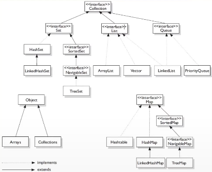

# Visão geral: Collections Framework

### Collection

* Collection é um objeto que agrupa múltiplos elementos (varáveis primitivas ou objetos) dentro de uma única unidade

* Serve para armazenar e manipular conjunto de dados de forma eficiente

* Antes do Java 2 (JDK 1.2)

  * implementação de coleções na linguagem Java

    * poucas classes

    * não tinha a organização de um framework

  * Problemas do **Array**

    * tamanho fixo
    * remoção muito complexa de um elemento

  * Com o as **Collections** todos esses problemas foram resolvidos

* **Composição da Collections**

  * **Interfaces** = é um contrato que quando assumido por uma classe deve ser implementado

  * **Implementações / Classes** = são as materializações, as codificação das interfaces

  * **Algoritmos** = é uma sequência lógica finita e definida de instruções que devem ser seguidas para resolver um problemas

* **Hierarquia das Collections**

  

  > TreeSet e Hashtable são implementações thread-safe