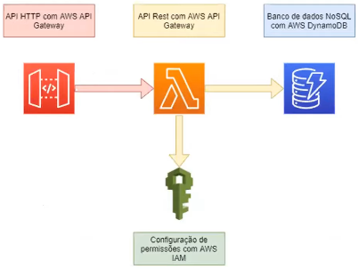

# Conceitos iniciais sobre AWS e arquitetura do projeto prático

### História do AWS

* Criado em 2006

* Provedor de serviços em nuvem que oferece serviços de infraestruturas de TI para empresas por meio da internet

# Conceitos iniciais sobre AWS

* Têm origem no AWS Well-Architected Framework

* 5 pilares 

  * **Segurança** = proteção por meio de recursos e arquitetura de hardware/software utilizados pelos servidores da AWS

  * **Eficiência de performance** = econômico, mas sem abrir mão da potência

  * **Confiabilidade** = sem queda dos servidores. Isso se dá pelo fato de possuir muitos _datacenters_ espalhado pelo mundo

  * **Excelência operacional**

  * **Otimização de custos**

  ### Objetivos

  - [X] Visualizar os recursos e categorias de serviços

  - [X] Criar uma API HTTP com endpoints de CRUD no **AWS API Gateway**

  - [X] Implementar uma função serverless em NodeJS com AWS Lambda

  - [X] Criar uma tabela no banco de dados com **AWS DynamoDB** (Banco de dados não relacional)

  - [X] Configurar permissões de acesso aos serviços da AWS baseadas em _Roles_ e _Policies_ com **AWS IAM**

  - [X] Configurar integração entre os serviços AWS

  ### Arquitetura do projeto prático

  

