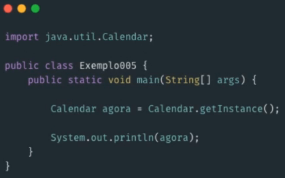
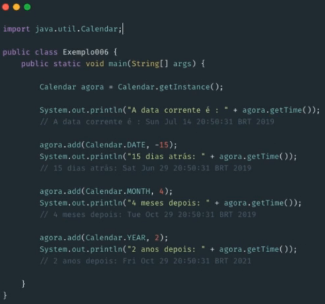
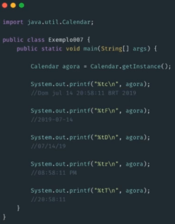

# Classe Calendar

### Calendar (`java.util.Calendar`)

* Já no JDK 1.1 foi observado a necessidade de facilitar alguns recursos que a **classe Date** oferecia

* Com essa nova classe, alguns métodos e construtores da **classe Date** foram descontinuados (Exemplo: `Date(int year, int mouth, int date)`)

* Classe abstrada que provê métodos para converter data entre um instante específico

* Possui alguns campos específicos para manipulação como `MONTH`, `YEAR`, `HOUR`

* Exemplo de capturar o instante atual com a **Classe Calendar**

  

* Manipulação de datas

  

* Impressão de data e hora

  