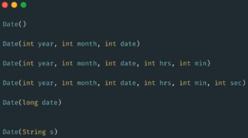
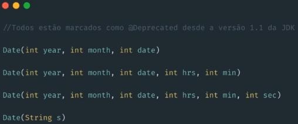
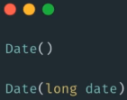
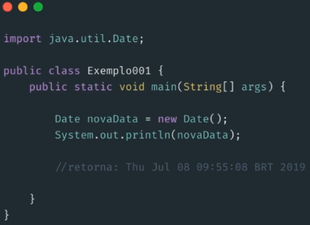
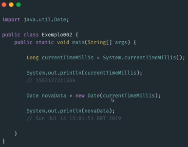
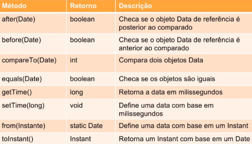
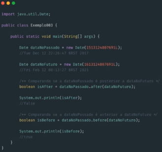
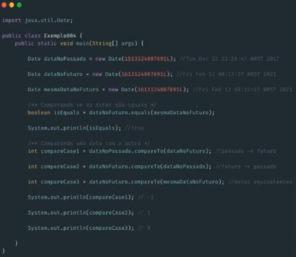
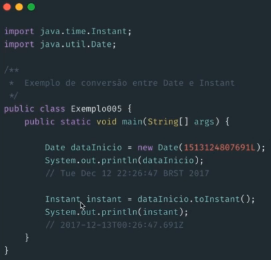

# Classe Date

### Date (`java.util.Date`)

* A implementação do `java.util.Date` está na JDK desde a versão 1.0

* Algumas funcionalidades, atualmente, se tornaram obsoletas

* Construtores da **Classe Date**

  

  * Alguns desses construtores estão descontinuados (anotado com `@Deprecated`)

    

  * Construtores mais utilizados

    

    * `Date()`

      * Este construtor vai alocar um objeto da classe Date

      * A inicialização dessa classe será o **milissegundo mais próximo** do período de sua execução

      * Exemplo

        

    * `Date(long date)`

      * Este construtor espera como argumento o tempo no padrão epoch, em milissegundos

        > **epoch** = milissegundos deste `1 de janeiro de 1970 00:00:00` (data início do **Unix Epoch**)

      * `System.currentTimeMillis()` = método estático que retorna o milissegundos mais próximo de sua execução, com base no Sistema Operacional

      * Exemplo

        

* Métodos da **Classe Date**

  * Métodos úteis

      

      * Exemplo `after(Date)` e `before(Date)`

        

      * Exemplo `compareTo(Date)` e `equals(Date)`

        

      * Exemplo `from(Instant)` e `toInstant()`

        

        * **Classe Instant**

          * Surgiu no JDK 1.8
          * Imutável e thread-safe
          * Modela um ponto instantâneo de uma linha do tempo
          * Indicado para gravar marcações temporais em eventos da sua aplicação

        