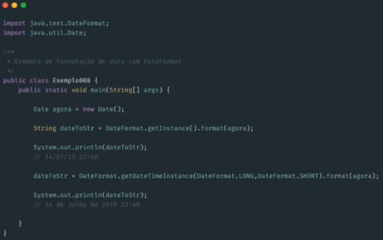
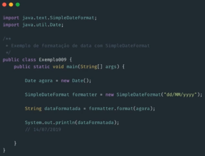

# Classe DateFormat

### DateFormat (`java.text.DateFormat`)

* Existem 2 classes de formatação de datas

  > Ambos oferecem maneiras de formatar e parsear a saída das datas

  * **DateFormat**

    

  * **SimpleDateFormat**

    * Definir um padrão de formatação específica para saída de data

    