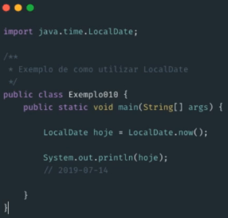
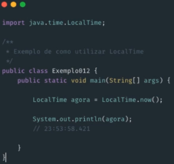
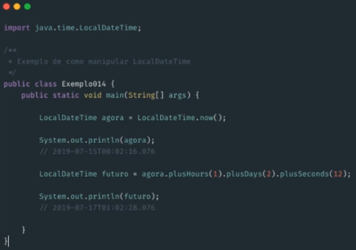

# Conhecendo date a partir do Java 8

### Datas antes Java 8+

* Basicamente possuía, como principais classes de manipulação de data, o **Date** e **Calendar**

* A manipulação era confusa e trabalhosa

* **Date** e **Calendar** são mutáveis, podendo causar problemas 

### Datas no Java 8+

* Várias novidades para facilitar o trabalho com datas

* Grande melhoria com o pacote `java.time`

  > `java.time` foi herdado do projeto **Jada Time**

* Principais novas classes

  * **LocalDate**

    * Classe imutável para representar um **apenas data**

    * Formato padrão: `yyyy-MM-dd`

    * Exemplo

      

  * **LocalTime**

    * Classe imutável para representar hora

    > Pode ser representado até no nível de nanosegundos.

    * Formato padrão: `HH:mm:ss:SSS`

    * Exemplo

      

  * **LocalDateTime**

    * Funciona com uma junção entre **LocaDate** e **LocalTime**

    * Classe imutável para representar data e hora

    > Pode ser representado até no nível de nanosegundos.

    * Formato padrão: `yyyy-MM-dd HH:mm:ss:SSS`

    * Exemplo

      

