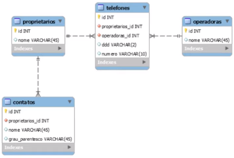
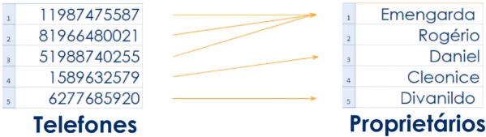

# Fundamentos de banco de dados

## Objetivos da aula

- [X] Fundamentos de banco de dados
- [X] Modelo relacional
- [X] Introdução ao PostgreSQL

### Fundamentos de banco de dados

* O que são dados?

  * Valores brutos
  * Fatos brutos
  * Observações documentadas
  * Registros soltos (recolhidos e armazenados sem tratamento)

* O que são informações

  * Exemplos: 
    * Estruturação de dados
    * Organização de dados

  * Conjunto de dados relacionados entre si que geram valor (sentidos) aos dados

### Modelo relacional

* Modelar = criar um modelo, que por sua vez explica as características/funcionamento (comportamento) de um software

* Modelo de dados = ferramentas que demonstram como as estruturas de dados estão organizas e relacionadas entre si

* Modelo relacional (mais comum) = modelo de dados representativo e que são armazenadas em tabelas (linhas e colunas)
  * Colunas = atributos de um dados

* Informações relacionais

  

* Tabelas

  * Conjuntos de dados dispostos eem colunas e linhas referentes a um objeto comum

    * Colunas = "campos da tabela" <=> atributos da tabela
    * Linhas (tuplas) = armazenam os valores / dados

  * O que pode ser definido como tabela?

    * Coisas tangíveis (concretas)

      * Exemplo: Elementos físicos (carro, produto, animal)

    * Funções

      * Exemplo: Perfis de usuário, status de compra

    * Eventos ou ocorrências

      * Exemplo: Produtos de um pedido, histórico de dados

  * Colunas importantes

    * Chave primária (Primary Key / PK)

      * Conjunto de um ou mais campos únicos

      * Identidade da tabela

      * Função: índice de referência na criação de 
      relacionamentos entre tabelas

      * Nomes comuns da coluna = "id" / "codigo" / "numero"

    * Chave estrangeira (Foreign Key / FK)

      * Valor de referência a uma PK de outra tabela

      * Função: criar relacionamentos entre tabelas

* Sistemas de gerenciamento de banco de dados (Sistema de gestão de base de dados)

  * SGBD = (S)istemas de (G)erenciamento de (B)anco de (D)ados
  
  * Conjunto de software responsáveis pelo gerencionamento de um banco de dados

  * Software que facilitam a administração de um banco de dados

  * Exemplos

    * Oracle DataBase
    * PostgreSQL
    * MySQL
    * SQL Server
    * MongoDB
    * ElasticSearch
    * IBM DataBase
    * Redis

### Introdução ao PostgreSQL

* O que é PostgreSQL

  * Sistema de gerenciamento de banco de dados objeto relacional

  * Criado em 1986, pelo Departamento de Ciência da Computação na Universidade da Califórnia, em Berkeley

  * SGBD OpenSource

* Arquitetura (multiprocessos e cliente/servidor)

  

* Principal características

  * OpenSource

  * _Point in time recovery_ (restauração segura)

  * Linguagem procedural com suporte a várias linguagens de programações (Perl, Python, etc)

  * Views, functions, procedures, triggers

  * Consultas complexas e _Common Table Expressions_

  * Suporte a dados geográficos (PostGIS)

  * Controle de concorrência multi-versão
