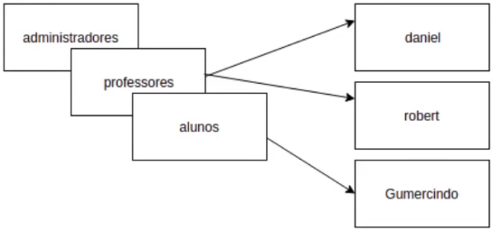

# Como administrar usuários no banco de dados

### users / roles / groups

* **Definição**

  * _Roles_: papéis ou funções

  * _Users_: usuários

  * _Groups_: grupos de usuários (perfis, "conta") que atuam em um banco de dado

  > Cada um (users / roles / groups) possui permissões em comum ou específicas

  * Usuários e _roles_ com comportamentos diferentes (**versões anterior ao PostgreSQL 8.1**)

  * É possível que _roles_ pertençam a outras _roles_

* **Representação**

  

  * Roles: administradores, professores, alunos, daniel, professores, alunos

### Administrando users / roles/ groups

* **Sintaxe**

  ```sql
  CREATE ROLE <nome> <opções>
  ```

* **Possíveis opções**

  Opção 1 | Opção 2 | Padrão
  :-----: | :-----: | :-----:
  SUPERUSER | NOSUPERUSER | NOSUPERUSER
  CREATEDB | NOCREATEDB | NOCREATEDB
  CREATEROLE | NOCREATEROLE | NOCREATEROLE
  INHERIT (herdar as pemissões de um outra role ) | NOINHERIT | ---
  LOGIN | NOLOGIN | ---
  REPLICATION | NOREPLICATION | ---
  BYPASSRLS (by pass role level security) | NOBYPASSRLS | ---
  CONNECTION LIMIT [conexões] | --- | ---
  [ ENCRYPTED ] PASSWORD '[senha]' | PASSWORD NULL | ---
  VALID UNTIL '[data]' (definir até que data um usuário possa se conectar) | --- | ---
  IN ROLE [nome da role] | --- | ---
  IN GROUP [nome da role] | --- | ---
  ROLE [nome da role] | --- | ---
  ADMIN [nome da role] | --- | ---
  USER [nome da role] (**descontinuada**)
  SYSID [uid(user id)] (**descontinuada**) | --- | ---

* **Exemplo**

  

  

  

* **Associação entre roles**

  * Quando uma role assume as permissões de outra role é necessário a opção **`INHERIT`**

  * No momento de criação da _role_

    * **`IN ROLE`** = passa a pertencer a role informada

    * **`ROLE`** = a role informada passa a pertencer a nova _role_

  * Após a criação da role:

    > Esse comando deverá ser executado apenas se esquecer de atribuir uma role a outra na hora da associação entre eles.

    * ```sql
      GRANT [role a ser concedida] TO [role a assumir as permissões]
      ```

  * Exemplo

    

    

    

    

    

* **Desassociar membros entre roles**

  * **Sintaxe**
    
    ```sql
    REVOKE [role que será revogada] FROM [role que terá suas permissões revogadas]
    ```

  * **Exemplo**

    ```sql
    REVOKE professores FROM daniel
    ```

* **Alterar uma _role_**

  * **Sintaxe**

    ```sql
    ALTER ROLE [nome] [opções] 
    ``` 

    * **Possíveis opções**

      Opção 1 | Opção 2 | Padrão
      :-----: | :-----: | :-----:
      SUPERUSER | NOSUPERUSER | NOSUPERUSER
      CREATEDB | NOCREATEDB | NOCREATEDB
      CREATEROLE | NOCREATEROLE | NOCREATEROLE
      INHERIT (herdar as pemissões de um outra role ) | NOINHERIT | ---
      LOGIN | NOLOGIN | ---
      REPLICATION | NOREPLICATION | ---
      BYPASSRLS (by pass role level security) | NOBYPASSRLS | ---
      CONNECTION LIMIT [conexões] | --- | ---
      [ ENCRYPTED ] PASSWORD '[senha]' | PASSWORD NULL | ---
      VALID UNTIL '[data]' (definir até que data um usuário possa se conectar) | --- | ---

* **Excluir uma _role_**

  * **Sintaxe**

    ```sql
    DROP ROLE [nome]
    ```