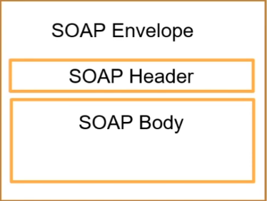
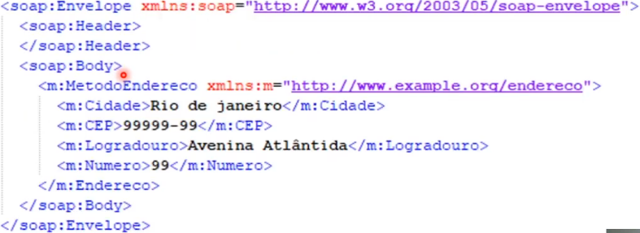

# Estrutura SOAP

### Definição

* > **SOAP** = (S)imple (O)bject (A)ccess (P)rotocol

* É um protocolo baseado em **XML** para acessar serviços web, principalmente por **HTTP**

* Pode-se dizer que SOAP é uma definição de como serviços web se comunicam

* Foi desenvolvido para facilitar integração entre aplicações

### Vantagens

* Permite integrações entre aplicações, independente da linguagem, pois usa como linguagem comum o **XML**

* É independente de plataforma e _software_

* Meio de transporte genérico, ou seja, pode ser usado por outros protocolos além do **HTTP**

### Estrutura SOAP (_SOAP Message_)

* Possui uma estrutura única que deve sempre ser seguida

* **Representação**

  

  * **SOAP Envelope** = primero elemento do documento e é usado para encapsular toda a mensagem **SOAP**

  * **SOAP Header** = informações de atributos e metadados da requisição (**Exemplo**: IP de origem / DNS / credenciais de autenticação)

  * **SOAP Body** = detalhes da Mensagem

* **Exemplo**

  

### Definição de XML

> **XML** = (E)xtensible (M)arkup (L)anguage

* É uma linguagem de marcação criada na década de 90 pelo **W3C**

* Facilita a separação de conteúdo

* Não tem limitação de criação de _tags_ (etiquetas)

* Não tem limitação de criação de _tags_

* Linguagem comum para integrações entre aplicações