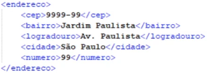
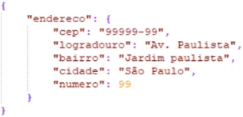

# O que são Web Services

* Serviços Web ou Web Services

* São soluções para aplicações se comunicarem independentemente da linguagem, software e hardware

* Foram criados para "trocar mensagens" utilizando a linguagem **XML** (Extensible Markup Language) ou **JSON** (JavaScript Object Notation) sobre o protocolo **HTTP** sendo identificado por **URI** (Uniform Resource Identifier)

* **Conclusão**: São API's que se comunicam por meio de redes sobre o protocolo **HTTP**

* **Exemplo de repostas de um Web Service**

  * **XML**

    

  * **JSON**

    

* **Vantagens**

  * Linguagem comum (JSON ou XML)

  * Integração mais fácil entre aplicações

  * Reutilização de implementação

  * Mais segurança

  * Redução de custos

* **Principais tecnologias**

  * SOAP (utiliza, geralmente, XML)

  * REST

  * XML

  * JSON