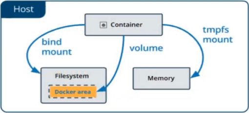
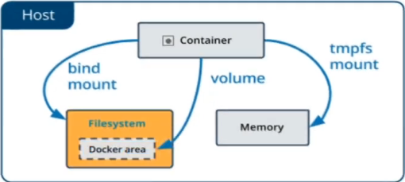

# Tipos de armazenamento

### Volume

* É um "disco virtual" no qual o Docker Engine tem controle total sobre ele

* Pode ser criado no momento da criação do _container_ 

* Documentação: [docs.docker](https://docs.docker.com/storage/volumes/)

### Bind Mounts

* É uma "pasta compartilhada" entre o host e o _container_

* **OBS**: os dados dentro do container, após ser parado ou eliminado, são salvos em disco, ou seja, **não há perda de informações**

* Documentação: [docs.docker](https://docs.docker.com/storage/bind-mounts/)

### tmpfs Mounts

> **tmpfs** = temporary filesystem

* Com um _tmpfs mount_ o _container_ pode criar arquivos fora da camada de escrita dele, o que **reduz o consume de recursos (disco) do _host_**

* Os dados são persistidos em memória, portanto ao parar o _container_ essas informações são apagadas

* Documentação: [docs.docker](https://docs.docker.com/storage/tmpfs/)