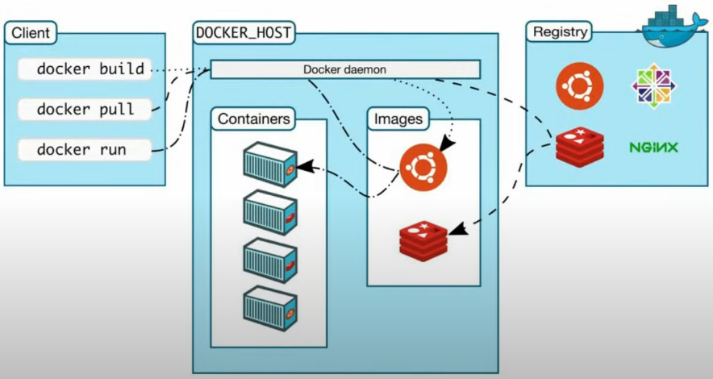

# Arquitetura do Docker

### Terminologias

* **Container image**
  
  * **Definição**: conjunto de pacotes para criação do _container_ 

* **Dockerfile**
  
  * **Definição**: arquivo teste que contém as instruções para criação da imagem

  * **Exemplo**

    

* **Build**

  * **Definição**: ação de construir uma imagem a partir de um Dockerfile

* **Container**

  * **Definição**: uma instância da imagem que representa uma aplicação ou processo

    > **OBS**: é possível ter várias instâncias da mesma imagem

* **Volumes**

  * **Definição**: permite o armazenamento de dados em disco, ou seja, caso o _container_ seja eliminados, o conteúdo dentro dele não é perdido

* **Tag**

  * **Definição**: "versão" da imagem -> facilita no visionamento de imagens

* **Multi-stage build**

  * **Definição**: entrelaçamento entre imagens

  * **Exemplo**

    

    

* **Repository**

  * **Definição**: coleção de imagens

* **Registry**

  * **Definição**: serviço que provê o acesso a um repositório

  * **Exemplo**: [Docker Hub](https://hub.docker.com/)

* **Compose**

  * **Definição**: ferramenta que facilita a criação de vários _containers_

### Arquitetura do Docker

