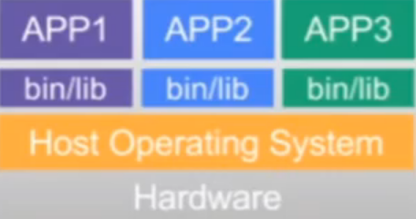
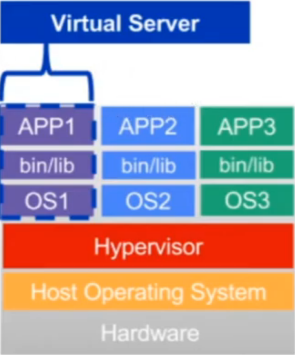
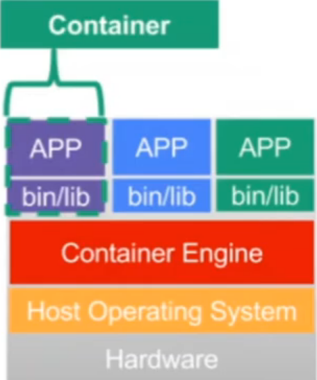

# VM e Container

### VM

> **VM** = (V)irtual (M)achine (Máquina virtual)

* **Caso 1** (Sem _container_)

  

  * Custo elevado (1 aplicação = 1 servidor)

  * Escalonamento vertical (ação de aumentar os recursos utilizados como CPU e Memória)

  * Difícil atualização + _downtime_ elevado

* **Caso 2**

  

  * Redução no custo (Compartilhamento de binários do servidor)

  * Falta de isolamento de dependências e serviços (pode gerar problemas entre as aplicações após alguma atualização)

  * Difícil atualização + _downtime_ elevado

* **Caso 3**

  

  * Maior isolamento entre aplicações (OS para cada app)

  * Snapshot da imagem da VM (recurso do _Hypervisor_) -> maior facilidade no salvamento e gerenciamento de backups

  * Redução no _downtime_ entre atualizações

* **Caso 4** (Com _container_)

  

    * Substituição do _Hypervisor_ pelo Container Engine (**Exemplo**: Docker) -> virtualização, em nível de sistema operacional, da aplicação

    * Imutabilidade das imagens (criação de uma imagem para fazer alterações)

    * Controle de memória e CPU para cada _container_

    * Escalonamento horizontal (ação de adicionar mais nós (VM/Container) de um sistema)

    * Atualização facilitada + sem _downtime_

    > Backup = imagem do _container_
