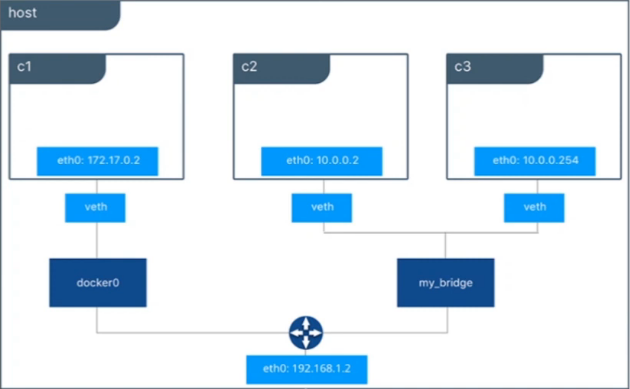
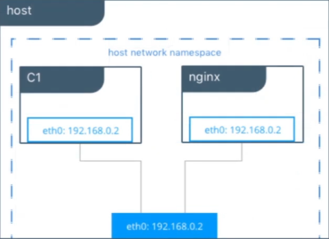
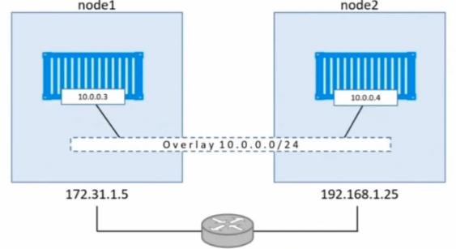

# Tipos de rede e como funciona

### Tipos de rede

* **Bridge**

  * **Definição**: é uma rede padrão do Docker, utilizado para comunicação entre containers

  * **Representação**

    

* **Host**

  * **Definição**: remover o isolamento de rede. O container responde diretamente pela placa de rede do host

  * **Representação**

    

* **Overlay**

  * **Definição**: permitir a comunicação entre containers de hosts diferentes

  * **Representação**

    

* **Macvlan**

  * **Definição**: permitir a atribuição de um endereço MAC ao _container_  tornado ele visível como um dispositivo físico na rede

    > **endereço MAC** (Media Access Control ou Controle de Acesso de Mídia) = é um endereço físico e único afim de identificar uma placa de rede ou dispositivo

* **None**

  * **Definição**: sem rede