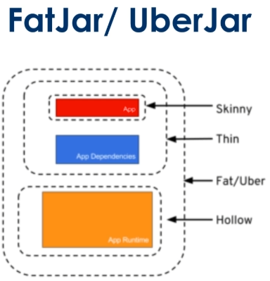

# FatJar / UberJar

### Antes do Spring Boot

* Spring tradicional: war (web.xml) precisa de servidor de aplicação
* Dependência de um _container_ web ou servidor de aplicação
* Complexidade para configurações
* Atualizações frequentes + versão de projeto
* Gerenciamento manual de configurações (Dispatcher Servlet, arquivos de configuração do servidor, etc)

### Com o Spring Boot

* Artefato do projeto pronto para execução
* Container web embutido na geração e execução (Tomcat, por padrão)
* Deploy embarcado com outros containers são opcionais
* Dependências principais do projeto embarcado (Tomcat, logging, suporte transacional)

* FatJAR

  

  > Hollow = web container (Tomcat)

  * Execução direta através do `java -jar`
    ```bash
    > mvn package && java -jar target/spring-boot-example-0.1.0.jar
    ```

  * Geração do arquivo war (forma tradicional)

    * Gradle: 
      ```gradle
      apply plugin: 'war'
      war {
        baseName = 'myapp'
        version = '0.5.0'
      }
      ```

    * Maven: 
      ```xml
      <packaging>war</packaging>
      ```

### Checklist

- [X] Fazer o build do projeto
  * Limpar e empacotar o projeto
    ```bash
    > mvn clean package
    ```

- [X] Explorar conteúdo do arquivo .jar gerado
  * Listagem do conteúdo do FatJAR
    ```bash
    > jar tf springboot.jar | less
    ```

- [X] Executar o projeto no terminal
  * Execução do FatJAR
    ```bash
    > java -jar springboot.jar
    ```
  
- [X] Trocar o formato do artefato para `.war` e executar no Tomcat
  * Por padrão, o empacotamento é no formato .jar, portanto no `pom.xml` essa configuração vem ocultada
    ```xml
    <packaging>jar</packaging>
    ``` 

  * Trocar o tipo do empacotamento de `jar` para `war`
    ```xml
    <packaging>war</packaging>
    ```

  * Execução do Tomcat
    ```bash
    > mv target/springboot.war apache-tomcat-9.0.26/webapps

    # Listar os arquivos da pasta webapps
    > ll apache-tomcat-9.0.26/webapps

    # Entrar na pasta apache-tomcat-9.0.26
    > cd apache-tomcat-9.0.26

    # Entrar na pasta com os scripts de execução
    > cd bin

    # Execução do script para iniciar o tomcat
    > ./startup.sh
    ```

### Links da aula

* [código fonte](https://github.com/rpeleias/springboot_digital_innovation_one)