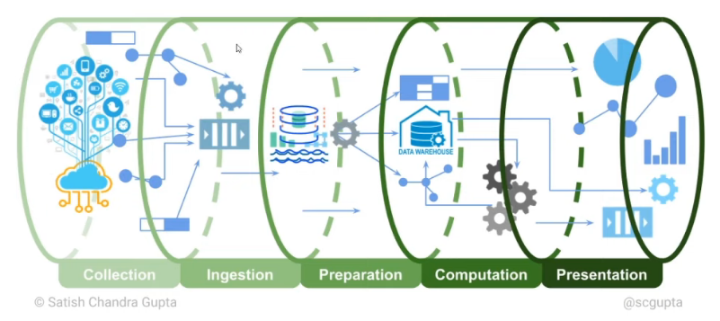

# Como transformar dados em informações

### Como aplicar AI / ML em dados errados

* **Principais falhas**

  * 85% dos projetos de Big Data falham

  * 87% dos projetos de ciência de dados nunca chegam à produção

  * **Aspectos relevantes ao criar um projetos de dados**

    * "Como você protege os dados?"

    * "Os dados subjacentes são tendenciosos?"

    * "Você pode usar os dados de maneira ética e legal para caso de uso pretendido?"

    * "Você pode processar os dados de maneira oportuna e com custo adequado?"

    * "Os dados estão limpos? (geralmente não)"

    * "Você pode limpar os dados?"

    * "Você sabe se os dados variam com o tempo?"

### Engenharia de dados

* Fatores para o aumento na demanda de engenheiros de dados

  * A crescente diversidade de dados

  * Necessidade de fornecer os dados certos às pessoas certas e no momento certo

* Os líderes de dados devem integrar a disciplina de engenharia de dados em sua estratégia de gerenciamento de dados

* É uma área que trata da transformação dos dados brutos de uma empresa

* Construir e mantes os _pipelines_ de dados da organização

### Passos para a transformação dos dados em informações

* 1º **Coletar** - Coletar dados de sistemas transacionais, rede sociais ou outras fontes de dados

* 2º **Armazenar** - Armazenar os dados que foram coletados para processamentos futuros

* 3º **Processar** - Aplicar regras de negócio e correlacionar dados para transformar dados em informação para o negócio

* 4º **Consumir** - Consumir as informações geradas para suportar as decisões de negócios

### Pipelines

### Alguns papeis

* **Engenheiro de dados** = desempenha um papel fundamental na construção e gerenciamento de _pipelines_ de dados e na promoção de casos de uso de dados e análises para produção (em linha com o processos de negócios)

* **Arquiteto de dados** = planejamento do _design_ da arquitetura de dados e construção do _roadmap_ tecnológico alinhado aos objetivos de negócio

* **Analista de dados** = responsável pela parte inicial do processo em Ciência de dados, como coleta de dados, limpeza, organização, transformação de pré-processamento de dados

* **Cientista de dados** = esse é um perfil de análise. Não de programador. O Cientista de Dados analisa problemas e encontra soluções. Para isso emprega conhecimento e, Estatística, Matemática, _Machine Learning_, Análise de Dados e conhecimento na área de negócios

* **DPO** (Data Protection Officer)

  * Com a Lei Geral da Proteção de Dados (LGPD), o DPO também tornou um outro perfil de profissional especializado que atual com proteção de dados

  * Além de conhecer bem os processo de Ciência de Dados, o DPO precisa conhecer as leis de proteção aos dados, suas implicações  regulamentação e segurança

### DataOPS

* É uma prática de gerenciamento de dados colaborativo focado em melhorar a comunicação, integração e automação de fluxos de dados entre gerenciadores de dados e consumidores de dados em um organização

* **Objetivos**

  * Entregar valor com mais rapidez

  * Criar entrega previsível

  * Gerenciar mudanças de dados, modelos de dados e artefatos relacionados

### Data Observability

* É a capacidade de uma organização de compreender totalmente a integridade dos dados, eliminando o tempo de inatividade dos dados e aplicando as melhores práticas de observabilidade do DevOps aos pipelines de dados

* **Função**

  * Entregar dados atualizados

  * Entregar dados dentro de um intervalo aceito

  * Entregar o volume de dados dentro do esperado

  * Aplicar mudanças de esquema dos dados

  * Corrigir dados e identificar processos impactos (**quebra do esquema de dados**)

### Estratégia de dados

* **Estratégia de negócio** = planejamento estratégico de negócio

* **Estratégia de dados** = estratégia de dados conectada a estratégia de negócio

* **Alavancada de resultados de negócios**

  * `estratégia de negócio + estratégia de dados = alavancada de resultados de negócios`

  * Alavanca os resultados de negócio e possibilita novas avenidas de negócio