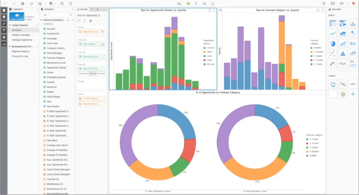
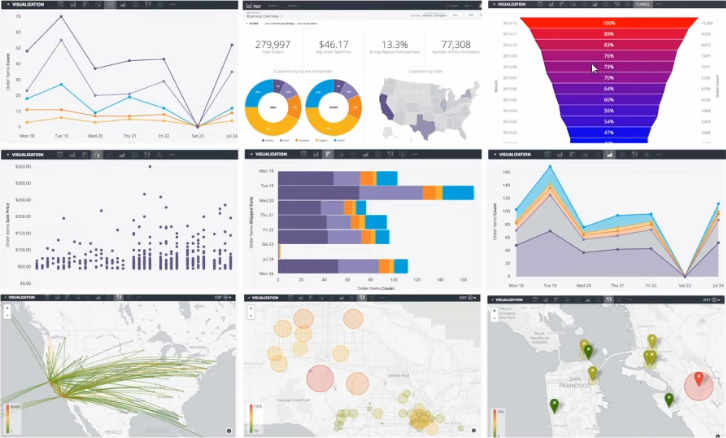

# Conceitos iniciais sobre BI

### Definição

> Processo de transformar dados em informações e informações em conhecimento - Gartner

### Propósito

* Converter o volume de dados em informações relevantes para negócio, por meio de relatórios analíticos

### Aplicações

* _Query Report_

* Mineração de dados

* _Budget_ e _Forecast_

* KPI's

* Dashboards de gestão

### Ferramentas

* MicroStrategy

  

* Google Data Studio

* Looker

  

* Microsoft Power BI

* Tableau

* QlikView

* Board

* Domo