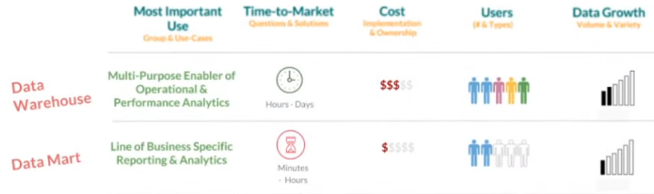

# Data marts

### Definição

* É um subconjunto de um _data warehouse_

* Orientado para uma única linha de negócio

* Contêm repositórios de dados resumidos coletados para análise em uma seção ou unidade específica dentro de uma organização

### DW VS DM

### _Inmon_ VS _Kimball_

* DW baseado na estratégia _Inmon_ (**top-down design**)

  

* DW baseado na estratégia _Kimball_ (**bottom-up design**)

  