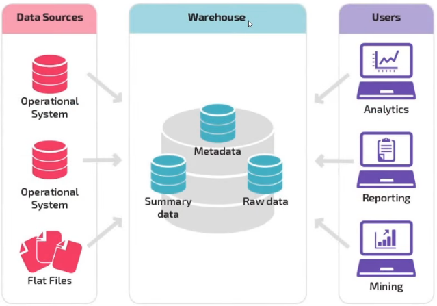
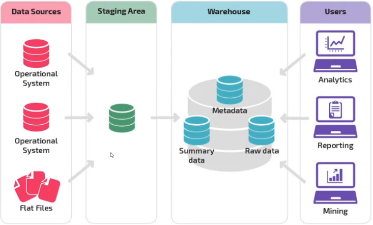
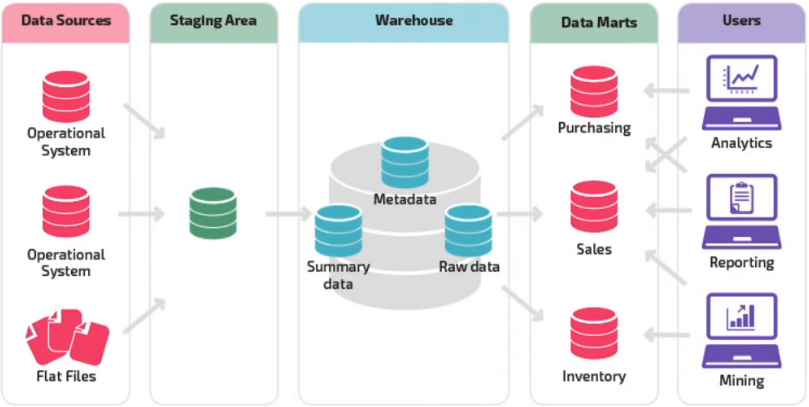
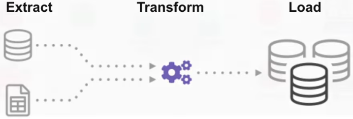
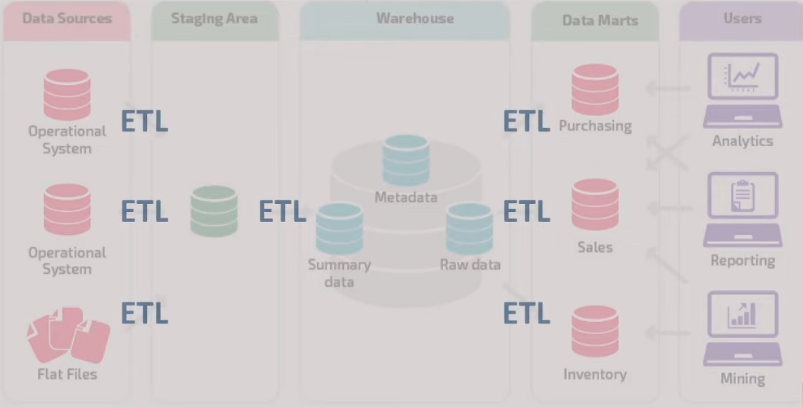

# Data warehouse (DW)

### Antes do Data Warehouse 

* Falta de credibilidade dos dados, como consequência de muitas extrações

* Baixa produtividades

* Dificuldade em gerar informação a partir dos dados extraídos

### Definição

* É uma arquitetura de armazenamento projetada para conter dados extraídos de sistema transacionais, armazenamentos de dados operacionais e fontes externas

* Combinações desses dados em um formulário de resumo agregado adequado para análise de dados em toda a empresa e relatórios para necessidades de negócios predefinidas

### OLTP VS OLAP

* **OLTP**

  > **OLTP** = (O)nline (T)ransactional (P)rocessing

  * **Características**

    * **Foco** = operações do dia a dia

    * **Origem** = transações em tempo real da organização

    * **Performance** = milissegundos

    * **Volatilidade** = atualizações curtas e rápidas iniciadas pelo usuário

    * **Design** = normalizado

* **OLAP**

  > **OLAP** = (O)nline (A)nalytical (P)rocessing

  * **Características**

    * **Foco** = suporte a decisão

    * **Origem** = Bases de dados de sistemas transacionais

    * **Performance** = minutos / horas (depende de cada caso de uso)

    * **Volatilidade** = geralmente grande devido à agregação de grandes conjuntos de dados

    * **Design** = desnormalizado

### Arquiteturas de um DW

* ***Arquitetura Básica***

  

* **Arquitetura _Staging Area_**

  

* **Arquitetura _Data Marts_**

  

  ### Movimentação de dados

  * **ETL**

    

    > **ETL** = (E)xtract, (T)ransform, (L)oad

    * É um processo automatizado que coleta dados brutos, extrai as informações necessárias para análise, transforma em um formato que atende as necessidades de negócios e carrega em um _data warehouse_

    * **ETL no DW**

      

    * **Tipos de movimentações**

      * **Tipos de movimentações de volumes de dados**
        * Cargas completas (_truncate_ e _load_) = esse processo, pode ocorrer diariamente, o banco de dados é apagado e recriado

        * Cargas incrementais (_data_ e _ID_)

        * Frequência (diária, semanal, mensal)

      * Pode ter uma melhora significativa na qualidade dos dados

        * Qualidade e padronização e validações dos dados

        * Metadados (descrevem os atributos dos dados)

    * **Principais desafios do ETL**

      * **Escalabilidade** = a escalabilidade é um dos recursos mais importantes em uma ferramenta ETL moderna

      * **Acurácia** = garantir que os dados que são transformados sejam precisos e completos

      * **Manusear fontes de dados diversas** = lidar com diversos tipos de fontes de dados