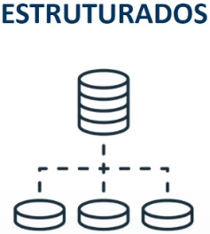
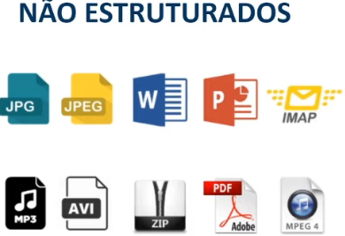
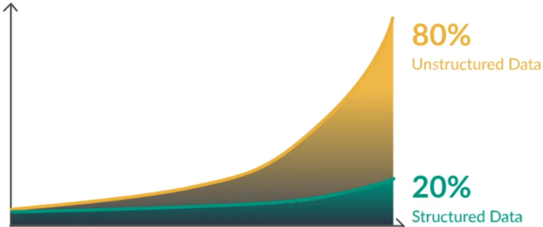
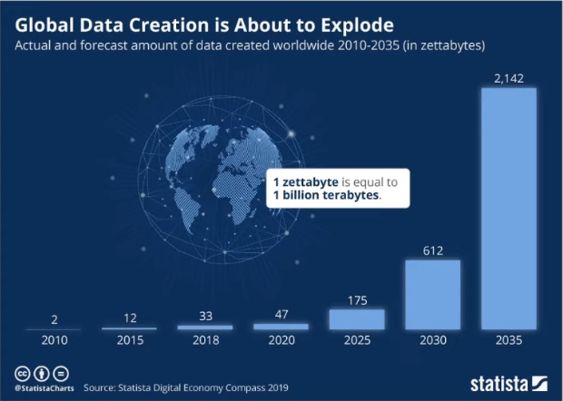

# O que são dados

### O que são dados

* **Exemplos de dados**

  * textos
  * números
  * vídeos
  * aúdios
  * observações
  * medidas
  * gráficos
  * fatos

* **De onde vêm esses dados**

  * mobile
  * browsers
  * veículos
  * sistemas
  * arquivos
  * midias socias
  * IoT
  * sensores

### Tipos de dados

* **Estruturados**

  

  * **Características**

    * Estrutura rígida e previamente planejada

    * Cada campo tem um formato único

    * Relação entre campos

* **Não estruturados**

  

  * **Características**

    * Sem estrutura previamente planejada

    * Dados flexíveis e dinâmicos

    * Complexidade em consultas

* Distribuição de dados estruturados e não estruturados

### Crescimento dos dados

### Desafios de um engenheiro de dados

* Dados não estruturados

* Processamento necessário

* Visualização da informação

* Privacidade dos dados

### Importâncias dos dados

* **Maior precisão nas tomadas de decisões**

* Mais eficiência operacional

* Menos custos

* Menos riscos

### Dados VS Informação

* **Dados** = dados brutos / não organizados / sem contexto

* **Informação** 

  * `dados + processamento = informação`

  * Dados com contextos / baseados em negócios

### Cultura Data-driven

* Uma abordagem "orientada a dados", ou seja, tomar decisões estratégicas com base na análise e interpretação dos dados

* Permitir que as empresas examinem e organizem seus dados com o objetivo de atender melhor seus clientes e consumidores