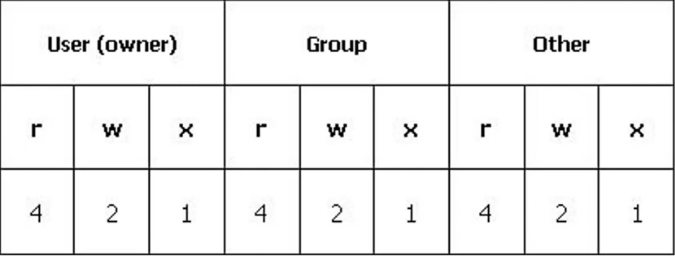

# Como gerenciar permissões em diretórios e o que é o modo octal

### Permissões em arquivos e diretórios

* Restringir acessos como:

  * Leitura (`r` - **(R)ead**)
  * Escrita (`w` - **(W)rite**)
  * Execução (`x` - **e(X)ecution**)

* Verificar permissões do diretório atual

  * **Comando**: `$ ls -lh`

  * Detalhes fornecidos por esse comando:

    * Nomes dos arquivos existentes dentro do diretório

    * Tamanho do arquivo

    * Data de criação

    * Por quem foi criado

    * Dono do usuário

    * Grupos que pertence ao diretório

    * Permissões

* Mudar a permissão de um arquivo ou diretório: `$ chmod`

### Modo Octal

> Lembrando: **(R)ead** / **(W)rite** / **e(X)ecution**

* A máscara octal é comporta por números sob a base 8 (**0 a 7**)

* O 1º dígito = usuário dono do ficheiro/diretório (**u**)

* 2º dígito = grupo (**g**)

* 3º dígito = outros (**o**)

> As permissões são especificadas para cada grupo