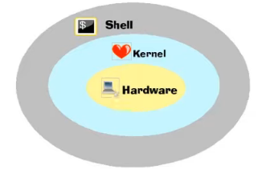

# História do Linux

### Fundamentos de Linux

* Criado em 1991 por Linus Torvalds

* Linux é o **Kernel** (ou núcleo do Sistema Operational)

  

  * **Kernel** = intermediação entre o hardware e o sistema operational

  * **Shell** = linha de comando

* É desenvolvido por diversas pessoas e empresas ao redor do mundo

* Multitarefa / Multiusuário

  * **Multitarefa** = execução de várias tarefas ao mesmo tempo

  * **Multiusuário** = criação de vários usuários no mesmo sistema operacional

### Distribuições (_distro_)

* O Linux pode ser "distribuído" por empresas, organizações ou pessoas

* Cada **distribuição** possui características próprias no OS. Por exemplo:

  * Configurações
  * Aplicações
  * Sistema de instalação

* Distros mais conhecidas

  * Ubuntu
  * Debian
  * Suse
  * Fedora
  * Red Hat (distribuição para uso corporativo)
  * Kali (distribuição para segurança da informação)

### Sistema Operacional Ubuntu

* OS de código aberto

* Desenvolvido pela Canonical

* Baseada no Kernel Linux e influenciado pelo Debian

* Grande aceitação em muitas comunidades e no mercado de trabalho